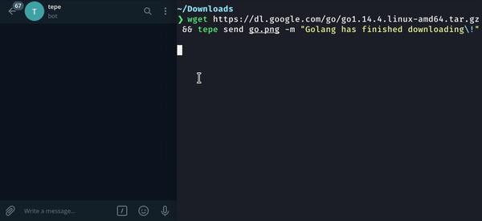

# Overview

[](https://crates.io/crates/tepe)

Wondering if your build finished? Tepe is a CLI that lets you command a bot to send messages and files over Telegram.



# Installation

## 1. Download Tepe

Be sure you've [installed Rust](http://rustup.rs/) on your computer.

```bash
git clone https://github.com/Hermitter/tepe && cd tepe
cargo install --path .
```

## 2. Create Your Bot and Save the Token

Talk to [@Botfather](https://t.me/botfather) and go through some dialog options until you've successfully created a bot. You should receive a token in the format of `123456789:blablabla`

Export the token by exposing it as an environmental variable

```bash
# Unix-like
export TEPE_TELEGRAM_BOT_TOKEN=__Place_Bot_Token_Here__
```

```bash
# Windows
set TEPE_TELEGRAM_BOT_TOKEN=__Place_Bot_Token_Here__
```

## 3. Find the Chat ID with your Bot

You can start talking to your bot by visiting (https://t.me/YOUR_BOT_NAME_HERE).

Once inside the chat, run the following command. The bot will print the `chat_id` of any chatroom that messages it.

```
tepe test
```

Example output:

```
*********************************************************************
Your Telegram bot is now running! Try sending it a message on Telegram.
On success, the chat_id is printed.

Press Ctrl+c to exit.

Successful reply from chat_id: 923567462
*********************************************************************
```

## 4. Send Messages

> TEPE_TELEGRAM_CHAT_ID can be used to avoid setting the same `chat_id` every time

You're now ready to send messages!

Example command:

```bash
tepe send ./shopping_list.txt ./some_photo.png -m "here are your things"
```

Usage:

```bash
USAGE:
    tepe send [OPTIONS] [--] [files]...

FLAGS:
    -h, --help       Prints help information
    -V, --version    Prints version information

OPTIONS:
    -c, --chat <chat_ids>...    Specifies a new Telegram chat id. This will not ignore the TEPE_TELEGRAM_CHAT_ID
                                variable.
    -m, --message <message>     String to pass into a Telegram message.
    -t, --token <token>         Sets the Telegram bot token. This ignores the TEPE_TELEGRAM_BOT_TOKEN variable.

ARGS:
    <files>...
```
